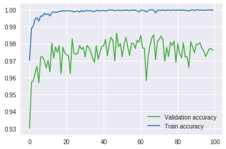
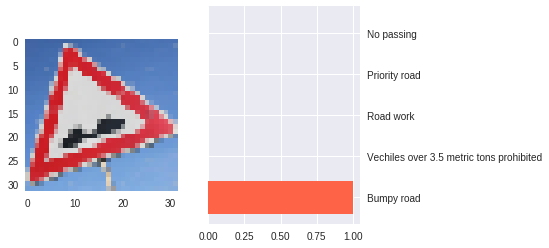
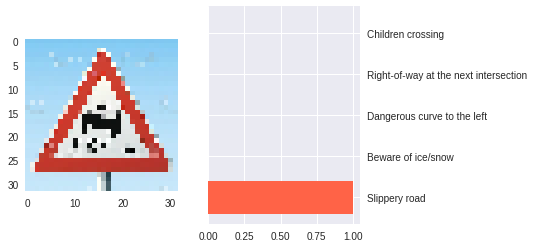
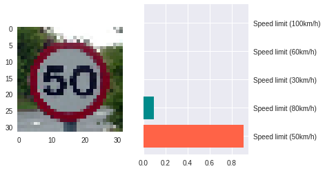
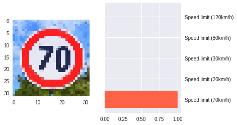
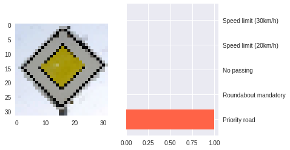

# Self-Driving Car Engineer Nanodegree
## Project: Build a Traffic Sign Recognition Classifier

## Overview
In this project, I used a convolutional neural network to classify traffic signs. 
## Dataset Summary & Exploration

#### 1. A basic summary of the data set. 

  Number of training examples = 34799  
  Number of testing examples = 12630                                                                                                   
  Number of validating examples = 4410   
  Image data shape = (32, 32, 3)   
  Number of classes = 43  


#### 2. An exploratory visualization of the dataset.

##  Randomly show images
  


##  Randomly show all classes images

    


# Show class images histogram

#### Show number of examples per class on train set

Here is an exploratory visualization of the training data set. It is a bar chart showing how the data is unbalanced.

   
   
#### Show number of examples per class on test and valid set


----

## Design and Test a Model Architecture

Design and implement a deep learning model that learns to recognize traffic signs. 

## 1. Pre-process the Data Set
As a first step, I decided to convert the images to grayscale.

```python
X_test_gry = np.sum(X_test/3, axis=3, keepdims=True)
X_train_gry = np.sum(X_train/3, axis=3, keepdims=True)
X_valid_gry = np.sum(X_valid/3, axis=3, keepdims=True)
```
Then, I normalize my data so that it has mean zero and equal variance. For image data, i used (pixel - 127.5)/ 127.5 as way to approximately normalize my data. 

```python
new_X_train = (X_train_gry - 127.5)/127.5
new_X_valid = (X_valid_gry - 127.5)/127.5
new_X_test =  (X_test_gry - 127.5)/127.5
```

#### The original images is not balanced, so i will generate additional data


#### Images generator
In order to tackle the problem of unbalanced data set, I've set 2000 as a fixed number of examples for each class. For that, i have used some techniques and geometric transformations, thanks to OpenCV2, such as translation, rotation and affine transformation.   

```python
for class_n in range(n_classes):
    class_indices = np.where(y_train == class_n)
    n_samples = len(class_indices[0])
    if n_samples < 2000:
        for i in range(2000 - n_samples):
            input_indices.append(class_indices[0][i%n_samples])
            output_indices.append(new_X_train.shape[0])
            new_img = new_X_train[class_indices[0][i % n_samples]]
            new_img = random_translate(random_scaling(random_warp(random_brightness(new_img))))
            new_X_train = np.concatenate((new_X_train, [new_img]), axis=0)
            y_train = np.concatenate((y_train, [class_n]), axis=0)
```

## 2. Model Architecture

My final model Inspired by LeNET consisted of the following layers:

| Layer         		|     Description	        					| 
|:----------------------|:----------------------------------------------| 
| Input         		| 32x32x1 Gray image   							| 
| Convolution 2D     	| 1x1 stride, outputs 28x28x32	|
| Activation					|	Tanh											|
| Max pooling	      	| 2x2 stride,  outputs 14x14x32 				|
| Convolution 2D      	| 1x1 stride, outputs 10x10x64 	|
| Activation					|	Tanh											|
| Max pooling	      	| 2x2 stride,  outputs 5x5x64	     	|
| Flatten             | outputs 1600
| Convolution 2D     	| 1x1 stride, outputs 1x1x400 	|
| Activation					|	Tanh											|
| Flatten              | outputs 400                   |
| Concat       | Inputs = 400 + 1600, Outputs = 800 |
| DropOut   	      	| keep Prob 			                |
| Fully connected		| outputs 43        				    		|

For more details, here's the tensorflow summary graph with Tensorboard. 


## 3. Train, Validate and Test the Model

### Train mode parameters

In retrain model, the parameters as follows:    
* learning rate = 0.0009
* betta = 0.001 ( For L2 regularization )  
* optimizer = Adam    
* batch size = 64    
* max epochs = 100

```python
Training...

EPOCH 1 
Validation Accuracy = 0.896
Train Accuracy = 0.921

EPOCH 2 
Validation Accuracy = 0.929
Train Accuracy = 0.968
 ....
EPOCH 98 
Validation Accuracy = 0.974
Train Accuracy = 1.000

EPOCH 99 
Validation Accuracy = 0.978
Train Accuracy = 1.000

EPOCH 100 
Validation Accuracy = 0.979
Train Accuracy = 1.000

```
And this is a graph that shows the evolution of the validation accuracy :



My final model results were:   
* Train Accuracy = 1.000  
* Validation Accuracy = 0.985    
* Test Accuracy = 0.97     

Firstly, I choose a pretrained model like VGG16, because it is classic way to use transfer learning but i have found that it is easyly overfitting. Then, i decided to choose another model which is LeNET in my case and make some adjustments by adding or taking away some layers, i've changed the activation function. I found that generating new samples and having a balanced data helped me improve accuracy. Finally, i've tuned my hyperparameters.    


## Test a Model on New Images

Here are 8 German traffic signs that I found on the web. 


    2 out of 8 signs were wrongly classified.
    The first and the second image might be difficult to classify because of their similarities with other traffic signs.

#### 2. Discuss the model's predictions on these new traffic signs and compare the results to predicting on the test set. At a minimum, discuss what the predictions were, the accuracy on these new predictions, and compare the accuracy to the accuracy on the test set (OPTIONAL: Discuss the results in more detail as described in the "Stand Out Suggestions" part of the rubric).

Here are the results of the prediction:

| Image			        |     Prediction	        					| 
|:----------------------|:----------------------------------------------| 
| Bumpy road |  Bumpy road                    			     		|
| Double-curve |  Beware of ice snow                   			     		|
| General caution       	| General caution         							|
| Speed limit (50km/h)  | Speed limit (50km/h)  						|
| Speed limit (70km/h)  | Speed limit (70km/h)  						|
| Turn left ahead 		| Turn left ahead		    	 				|
| Priority road|  Priority road 							|
| Slippery road|  Slippery road 							|
    
   









```
  For the last image, the model didn't rightly predict Doule curve sign. The top five soft max probabilities were:   
 ```


