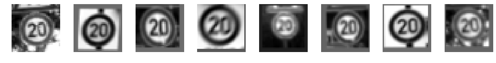
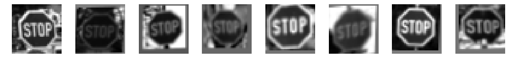
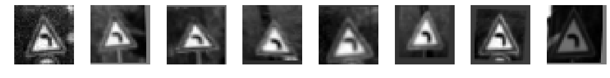

# Self-Driving Car Engineer Nanodegree
## Project: Build a Traffic Sign Recognition Classifier

## Overview
In this project, I used a convolutional neural network to classify traffic signs. 
## Dataset Summary & Exploration

#### 1. A basic summary of the data set. 

  Number of training examples = 34799  
  Number of testing examples = 12630                                                                                                   
  Number of validating examples = 4410   
  Image data shape = (32, 32, 3)   
  Number of classes = 43  


#### 2. An exploratory visualization of the dataset.

##  Randomly show images
  


##  Randomly show all classes iamges

    


# Show class images histogram

#### Show number of examples per class on train set

Here is an exploratory visualization of the training data set. It is a bar chart showing how the data is umbalanced.

   
   
#### Show number of examples per class on test and valid set


----

## Design and Test a Model Architecture

Design and implement a deep learning model that learns to recognize traffic signs. 

## 1. Pre-process the Data Set
As a first step, I decided to convert the images to grayscale.

```python
X_test_gry = np.sum(X_test/3, axis=3, keepdims=True)
X_train_gry = np.sum(X_train/3, axis=3, keepdims=True)
X_valid_gry = np.sum(X_valid/3, axis=3, keepdims=True)
```
Then, i normalize my data so that it has mean zero and equal variance. For image data, i used (pixel - 127.5)/ 127.5 as way to approximately normalize my data. 

```python
new_X_train = (X_train_gry - 127.5)/127.5
new_X_valid = (X_valid_gry - 127.5)/127.5
new_X_test =  (X_test_gry - 127.5)/127.5
```

#### The original images is not balanced, so i will generate additional data







#### Images generator
In order to tackle the problem of umbalanced data set, i've set 2000 as a fixed number of examples for each class. For that, i have used some techniques and geometric transformations, thanks to OpenCV2, such as translation, rotation and affine transformation.   

```python
for class_n in range(n_classes):
    class_indices = np.where(y_train == class_n)
    n_samples = len(class_indices[0])
    if n_samples < 2000:
        for i in range(2000 - n_samples):
            input_indices.append(class_indices[0][i%n_samples])
            output_indices.append(new_X_train.shape[0])
            new_img = new_X_train[class_indices[0][i % n_samples]]
            new_img = random_translate(random_scaling(random_warp(random_brightness(new_img))))
            new_X_train = np.concatenate((new_X_train, [new_img]), axis=0)
            y_train = np.concatenate((y_train, [class_n]), axis=0)
```

## 2. Model Architecture

My final model Inspired by LeNET consisted of the following layers:

| Layer         		|     Description	        					| 
|:----------------------|:----------------------------------------------| 
| Input         		| 32x32x1 Gray image   							| 
| Convolution 2D     	| 1x1 stride, same padding, outputs 28x28x6 	|
| Activation					|	Tanh											|
| Max pooling	      	| 2x2 stride,  outputs 14x14x6 				|
| Convolution 2D      	| 1x1 stride, same padding, outputs 10x10x16 	|
| Activation					|	Tanh											|
| Max pooling	      	| 2x2 stride,  outputs 5x5x16			     	|
| Flatten             | outputs 400
| Convolution 2D     	| 1x1 stride, same padding, outputs 1x1x400 	|
| Activation					|	Tanh											|
| Flatten              | outputs 400                   |
| Concat       | Inputs = 400 + 400, Outputs = 800 |
| DropOut   	      	| keep Prob 			                |
| Fully connected		| outputs 43        				    		|

For more details, here's the tensorflow summary graph with Tensorboard. 


## 3. Train, Validate and Test the Model

### Train mode parameters

In retrain model, the parameters as follows:    
* learning rate = 0.0009
* optimizer = Adam    
* batch size = 64    
* max epochs = 100

```python
Training...

EPOCH 1 
Validation Accuracy = 0.896
Train Accuracy = 0.921

EPOCH 2 
Validation Accuracy = 0.929
Train Accuracy = 0.968
 ....
EPOCH 98 
Validation Accuracy = 0.974
Train Accuracy = 1.000

EPOCH 99 
Validation Accuracy = 0.978
Train Accuracy = 1.000

EPOCH 100 
Validation Accuracy = 0.979
Train Accuracy = 1.000

```
And this is a graph that shows the evolution of the validation accuracy :


My final model results were:   
* Train Accuracy = 1.000  
* Validation Accuracy = 0.979    
* Test Accuracy = 0.965     

Firstly, I choose a pretrained model like VGG16, because it is classic way to use transfer learning but i have found that it is easyly overfitting. Then, i decided to choose another model which is LeNET in my case and make some adjustments by adding or taking away some layers, i've changed the activation function. I found that generating new samples and having a balanced data helped me improve accuracy. Finally, i've tuned my hyperparameters.    

## 5. Analysis Error Images

 Through the following picture, we known the images which have a shadow or over exposure lead to accuracy lowly.    
```
    The number of incorrectly predict labels is 153
```    


---

## Test a Model on New Images

Here are 8 German traffic signs that I found on the web. 


    2 of 8 signs were not well classified.
    The first and the second image might be difficult to classify because of their similarities with other traffic signs.

#### 2. Discuss the model's predictions on these new traffic signs and compare the results to predicting on the test set. At a minimum, discuss what the predictions were, the accuracy on these new predictions, and compare the accuracy to the accuracy on the test set (OPTIONAL: Discuss the results in more detail as described in the "Stand Out Suggestions" part of the rubric).

Here are the results of the prediction:

| Image			        |     Prediction	        					| 
|:----------------------|:----------------------------------------------| 
| Stop                  | Stop                    			     		| 
| Speed limit (50km/h)  | Speed limit (50km/h)  						|
| Road work         	| Road work         							|
| Turn left ahead  		| Turn left ahead		    	 				|
| Speed limit (120km/h)	| Speed limit (120km/h) 							|
    
The model was able to correctly guess 5 of the 5 traffic signs, which gives an accuracy of 100%. This compares favorably to the accuracy on the test set of 98.79%       

#### 3. Describe how certain the model is when predicting on each of the five new images by looking at the softmax probabilities for each prediction. Provide the top 5 softmax probabilities for each image along with the sign type of each probability. (OPTIONAL: as described in the "Stand Out Suggestions" part of the rubric, visualizations can also be provided such as bar charts)


 ```
  For the first image, the model rightly predicts Stop sign(probability of 1), and the image does contain a Stop sign. The top five soft max probabilities were:   
    * P0: 1.000000 - Stop
    * P1: 0.000000 - No entry
    * P2: 0.000000 - Road work
    * P3: 0.000000 - Speed limit (20km/h)
    * P4: 0.000000 - No vehicles
```

```
For the second image, the model is sure that this is a Speed limit (50km/h) sign (probability of 1), and the image does contain a Speed limit (50km/h) sign. The top five soft max probabilities were    
    * P0: 1.000000 - Speed limit (50km/h)
    * P1: 0.000000 - Double curve
    * P2: 0.000000 - Speed limit (60km/h)
    * P3: 0.000000 - Bicycles crossing
    * P4: 0.000000 - Ahead only
```

```
For the third image, the model is sure that this is a Road work sign (probability of 1), and the image does contain a Road work sign. The top five soft max probabilities were    
    * P0: 1.000000 - Road work
    * P1: 0.000000 - Stop
    * P2: 0.000000 - Bumpy road
    * P3: 0.000000 - Speed limit (70km/h)
    * P4: 0.000000 - Dangerous curve to the right
```

```
For the fourth image, the model is sure that this is a Turn left ahead sign (probability of 1), and the image does contain a Turn left ahead sign. The top five soft max probabilities were    
    * P0: 1.000000 - Turn left ahead
    * P1: 0.000000 - Ahead only
    * P2: 0.000000 - Vehicles over 3.5 metric tons prohibited
    * P3: 0.000000 - Go straight or left
    * P4: 0.000000 - Go straight or right
```

```
For the fifth image, the model is sure that this is a Speed limit (120km/h) sign (probability of 1), and the image does contain a Speed limit (120km/h) sign. The top five soft max probabilities were    
    * P0: 0.999934 - Speed limit (120km/h)
    * P1: 0.000066 - Speed limit (20km/h)
    * P2: 0.000000 - Speed limit (70km/h)
    * P3: 0.000000 - Keep left
    * P4: 0.000000 - Vehicles over 3.5 metric tons prohibited
```    


---

### (Optional) Visualizing the Neural Network (See Step 4 of the Ipython notebook for more details)
#### 1. Discuss the visual output of your trained network's feature maps. What characteristics did the neural network use to make classifications?


### Conv Layer 1


```python
output_Layer_FeatureMap(image_input,1)
```

    INFO:tensorflow:Restoring parameters from ./model/
    Tensor("conv1_activation:0", shape=(?, 32, 32, 32), dtype=float32)
    


### Conv Layer 2


```python
output_Layer_FeatureMap(image_input,2)
```

    INFO:tensorflow:Restoring parameters from ./model/
    Tensor("conv2_activation:0", shape=(?, 32, 32, 32), dtype=float32)
    


### Conv Layer 3


```python
output_Layer_FeatureMap(image_input,3)
```

    INFO:tensorflow:Restoring parameters from ./model/
    Tensor("conv3_activation:0", shape=(?, 16, 16, 64), dtype=float32)
    


```python
output_Layer_FeatureMap(image_input,4)
```

    INFO:tensorflow:Restoring parameters from ./model/
    Tensor("conv4_activation:0", shape=(?, 16, 16, 64), dtype=float32)
    


```python
output_Layer_FeatureMap(image_input,4)
```

    INFO:tensorflow:Restoring parameters from ./model/
    Tensor("conv4_activation:0", shape=(?, 16, 16, 64), dtype=float32)
    


```python
output_Layer_FeatureMap(image_input,5)
```

    INFO:tensorflow:Restoring parameters from ./model/
    Tensor("conv5_activation:0", shape=(?, 8, 8, 128), dtype=float32)
    
